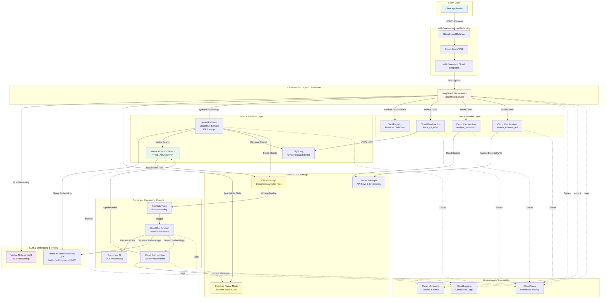
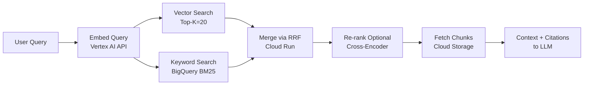
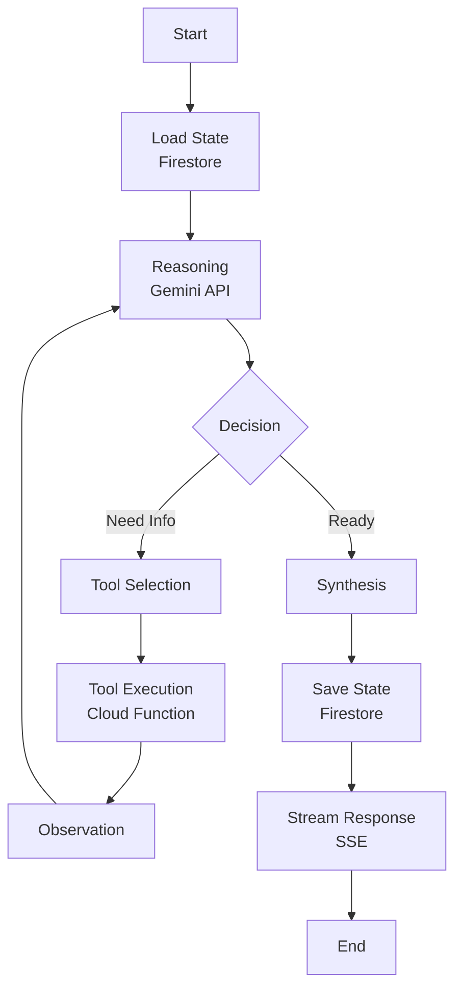
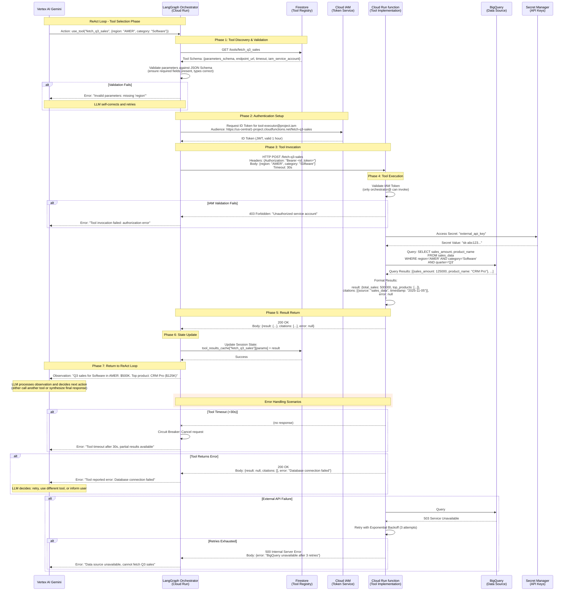
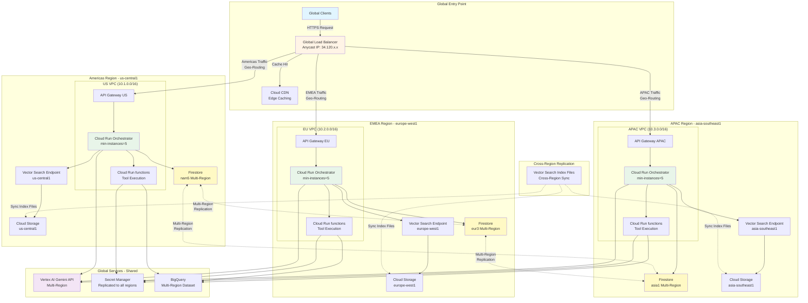

# **Agentic AI Framework on GCP: Technical Architecture Deep-Dive**

*Systems Architecture for Solutions Architects*

---

## **1. Introduction**

### Purpose

This document provides a **systems-level architecture deep-dive** for the Agentic AI framework on Google Cloud Platform. It bridges the gap between the high-level overview and implementation-level code, focusing on:

- **GCP service selection and configuration** for each component
- **Integration patterns** showing how services communicate
- **Architectural decisions** with documented tradeoffs
- **Deployment topologies** for production scenarios

### Audience

Solutions Architects evaluating, designing, or extending agentic AI systems on GCP. Assumes familiarity with cloud architecture patterns and GCP services.

### What This Adds

While the overview document answers "what" and "why," this deep-dive answers:
- **Which specific GCP services** power each capability
- **How services integrate** at the API and data flow level
- **Why specific services were chosen** over alternatives
- **How the system scales, secures, and observes** at the platform level

### How to Use This Document

- **Evaluating the architecture**: Read sections 2-5 to understand service choices
- **Making design decisions**: Review section 6 (ADRs) for documented tradeoffs
- **Planning deployment**: Use section 7 for topology guidance

### Full System Architecture

The following diagram shows the complete GCP architecture with all major services and their interactions:



**Key Flows**:
1. **User Query**: Client → GLB → API Gateway → Orchestrator → LLM + RAG → Response
2. **Document Ingestion**: GCS Upload → Pub/Sub → Processing Function → Embedding → Index Update
3. **Tool Execution**: Orchestrator → Tool Registry Lookup → Cloud Function Invocation → Result Return
4. **State Management**: Orchestrator ↔ Firestore (read/write session state throughout ReAct loop)

---

## **2. RAG Implementation Architecture**

Retrieval-Augmented Generation (RAG) ensures grounded, citation-backed responses by combining semantic search with structured data retrieval. This section details the GCP services and patterns that power the RAG pipeline.

### 2.1 Embedding Pipeline

**Service Stack:**
- **Vertex AI Text Embedding API**: Generates dense vector embeddings using `textembedding-gecko@003` model (768 dimensions)
- **Cloud Storage**: Raw document storage (PDFs, Markdown, structured data exports)
- **Cloud Run functions**: Document processing orchestration
- **Pub/Sub**: Async event-driven triggering for new/updated documents

**Pipeline Flow:**

1. **Document Ingestion**
   - Documents uploaded to **Cloud Storage bucket** (`gs://docs-raw/`)
   - Storage trigger fires **Pub/Sub topic** (`doc-processing`)
   - Cloud Run function (`process-document`) subscribes to topic

2. **Document Processing**
   - Extract text (Cloud Document AI for PDFs, native parsers for JSON/CSV)
   - Chunk text with **overlapping windows** (default: 512 tokens, 128 token overlap)
   - Preserve metadata (source, timestamp, section headers, document ID)

3. **Embedding Generation**
   - Batch chunks (up to 250 per API call for efficiency)
   - Call **Vertex AI Text Embedding API** with `RETRIEVAL_DOCUMENT` task type
   - Store embeddings + metadata in staging Cloud Storage (`gs://embeddings-staging/`)

4. **Index Update Trigger**
   - Staging bucket triggers another Cloud Run function (`update-vector-index`)
   - Function streams embeddings to **Vertex AI Vector Search index**

**Key Design Decisions:**
- **Batch size (250)**: Balances API quota limits with processing speed
- **Overlapping chunks**: Prevents loss of context at chunk boundaries; critical for semantic coherence
- **Streaming updates**: Real-time index updates vs. nightly batch rebuilds; streaming chosen for typically <5min freshness (data availability)

### 2.2 Vector Search Service Configuration

**Service**: Vertex AI Vector Search (formerly Matching Engine)

**Index Configuration:**

| Parameter | Value | Rationale |
|-----------|-------|-----------|
| **Algorithm** | `TREE_AH` (Tree and Asymmetric Hashing) | Balanced recall (>95%) and query latency (<50ms at p99) for 10M+ vectors |
| **Distance Measure** | `DOT_PRODUCT_DISTANCE` | Matches Vertex AI embedding model's native similarity metric |
| **Approximate Neighbors** | 10-20 candidates | Retrieves top-K for re-ranking; allows precision/recall tuning post-retrieval |
| **Shard Count** | Auto (managed by service) | Horizontal scaling handled by GCP; manual sharding for 100M+ vectors |
| **Index Update Mode** | `STREAM_UPDATE` | Near real-time updates (<5min); batch mode adds hours of latency |

**Storage Backend:**
- **Cloud Storage**: Stores index files (`gs://vector-index-bucket/`)
- **Deployed Index Endpoint**: Serves queries via gRPC/REST API (regional deployment)

**Deployment Topology:**
- **Single-region** for <10M vectors: `us-central1` index endpoint
- **Multi-region** for global latency: Deploy endpoints in `us-central1`, `europe-west1`, `asia-southeast1`; route queries via Global Load Balancer

**Integration Pattern:**
```
Client Query → API Gateway → LangGraph Orchestrator
                               ↓
                         Vector Search gRPC API
                               ↓
                      Deployed Index Endpoint (regional)
                               ↓
                      Returns: [(vector_id, distance), ...]
```

### 2.3 Retrieval Pipeline

**Hybrid Search Pattern**: Combines vector similarity with keyword matching for robust retrieval.

**Service Stack:**
- **Vertex AI Vector Search**: Semantic similarity (dense vectors)
- **BigQuery**: Keyword search via `SEARCH` function (inverted index on document text)
- **Cloud Run service (`hybrid-retriever`)**: Orchestrates parallel retrieval and merges results

**Retrieval Flow:**

1. **Query Embedding**
   - User query → Vertex AI Text Embedding API (`RETRIEVAL_QUERY` task type)
   - Generates 768-dim query vector

2. **Parallel Retrieval** (via Cloud Run service)
   - **Vector Search**: Query index with top-K=20 candidates
   - **Keyword Search**: BigQuery `SEARCH(doc_text, 'user query terms')` with BM25 scoring (top-N=20)
   - Both execute concurrently (async API calls)

3. **Result Merging**
   - **Reciprocal Rank Fusion (RRF)**: Combines vector and keyword scores
   - Formula: `score = 1/(k + rank_vector) + 1/(k + rank_keyword)`, where k=60 (tunable constant)
   - Re-ranks merged candidate set (up to 40 unique documents)

4. **Re-Ranking (Optional)**
   - For critical queries, apply **cross-encoder** via Vertex AI Prediction endpoint
   - Model: Fine-tuned `BERT-large` for query-document relevance
   - Reduces top-40 to final top-5 with >10% precision improvement

5. **Context Assembly**
   - Fetch full document chunks from Cloud Storage (by `doc_id`)
   - Attach metadata: source URL, timestamp, chunk position
   - Format for LLM prompt (max 4K tokens of context)

**Citation Tracking:**
- Each retrieved chunk includes `citation_id` (hash of `doc_id + chunk_index`)
- LLM prompt instructs to reference citations in response
- Final response JSON includes `citations: [{id, source, snippet}]`

**Key Design Decisions:**
- **Hybrid search**: Pure vector search fails on exact keyword matches (e.g., product codes); keyword search fails on semantic paraphrases
- **RRF over weighted sum**: More robust to score scale differences between vector/keyword systems
- **Re-ranking tradeoff**: Adds 200-300ms latency but critical for high-stakes queries (e.g., compliance questions)

### 2.4 Data Flow Diagram



---

## **3. LangGraph Orchestration Architecture**

LangGraph orchestrates the agentic reasoning loop (ReAct pattern), managing state, tool invocation, and multi-turn conversations. This section details the GCP services that implement the orchestration layer.

### 3.1 State Management Design

**Service**: **Firestore (Native Mode)**

**Why Firestore:**
- **Document model** maps naturally to conversation sessions
- **Transactional updates** for consistent state transitions
- **Real-time listeners** enable streaming updates to clients
- **Auto-scaling** with no capacity planning (vs. Memorystore Redis clusters)

**Document Structure:**

```
Collection: sessions/{session_id}
Document Schema:
{
  user_id: string,
  created_at: timestamp,
  updated_at: timestamp,
  conversation_history: [
    {role: "user"|"assistant"|"tool", content: string, timestamp: timestamp}
  ],
  context_summary: string,  // LLM-generated summary of conversation so far
  ltm_pointers: [string],    // Document IDs for long-term memory embeddings
  tool_results_cache: {tool_name: {params: result}},  // Dedupe redundant tool calls
  metadata: {user_timezone, language, preferences}
}
```

**State Update Pattern:**
- **Read**: Fetch session document at request start
- **Write**: Batch update at conversation turn end (single transaction)
- **TTL**: Auto-delete sessions after 30 days (Firestore TTL policy)

**Long-Term Memory Strategy:**
- After 10 conversation turns, extract key facts via LLM (`summarize_conversation` function)
- Embed summary using Vertex AI Text Embedding API
- Store embedding in Vector Search index with session ID as metadata
- On future queries, retrieve relevant past conversations via semantic search

### 3.2 ReAct Loop Implementation Pattern

**Service Stack:**
- **Cloud Run**: Hosts LangGraph orchestrator service (Python FastAPI app)
- **Vertex AI Gemini API**: LLM reasoning engine
- **Cloud Run functions**: Individual tool implementations

**Why Cloud Run over Cloud Workflows:**
- **Flexibility**: ReAct loops require dynamic branching (not easily expressible in YAML-based Workflows)
- **Streaming**: Cloud Run supports Server-Sent Events (SSE) for real-time response streaming
- **Library support**: Native Python environment for LangGraph SDK
- **Debugging**: Standard logging/profiling tools vs. Workflows' opaque execution

**ReAct State Machine (LangGraph Nodes):**



**Node Implementations:**

1. **Reasoning Node** (`reason()`)
   - Input: Current state + conversation history + available tools
   - Process: Call Vertex AI Gemini with structured prompt (includes tool schemas)
   - Output: Action decision (`think`, `use_tool`, `respond`)

2. **Tool Selection Node** (`select_tool()`)
   - Input: Action decision with tool name + parameters
   - Process: Validate parameters against tool schema (JSON Schema validation)
   - Output: Tool invocation payload

3. **Tool Execution Node** (`execute_tool()`)
   - Input: Tool name + validated parameters
   - Process: Invoke Cloud Run function via HTTP POST (includes auth token)
   - Output: Tool result + error handling
   - Timeout: 30s per tool call (circuit breaker pattern)

4. **Synthesis Node** (`synthesize()`)
   - Input: All tool results + reasoning history
   - Process: Final Gemini API call with grounded context
   - Output: User-facing response + citations

**Error Handling:**
- **Tool timeout**: Return partial results + error message to LLM; LLM decides next step
- **LLM API error**: Retry with exponential backoff (3 attempts); fallback to cached response
- **Invalid tool parameters**: Return error to LLM; LLM self-corrects parameters

### 3.3 Tool Execution Framework

**Service**: **Cloud Run functions**

**Why Cloud Run functions:**
- **Isolation**: Each tool is an independent function (security boundary)
- **Scaling**: Auto-scale to zero when unused; scale to 1000+ concurrent for high load
- **Versioning**: Deploy new tool versions without orchestrator changes
- **Resource efficiency**: Pay-per-invocation (vs. always-on Cloud Run services)

**Tool Registry Pattern:**

Tools are registered in **Firestore collection** (`tools/{tool_name}`):

```
Document: tools/fetch_q3_sales
{
  name: "fetch_q3_sales",
  description: "Retrieves Q3 sales data by region and product category",
  parameters_schema: {
    type: "object",
    properties: {
      region: {type: "string", enum: ["AMER", "EMEA", "APAC"]},
      category: {type: "string"}
    },
    required: ["region"]
  },
  endpoint_url: "https://us-central1-project.cloudfunctions.net/fetch-q3-sales",
  timeout_seconds: 30,
  iam_service_account: "tool-executor@project.iam.gserviceaccount.com"
}
```

**Tool Invocation Flow:**

```
LangGraph Orchestrator (Cloud Run)
  ↓ (1) Lookup tool schema in Firestore
  ↓ (2) Validate parameters
  ↓ (3) Generate IAM ID token for service account
  ↓ (4) HTTP POST to Cloud Run function endpoint
  ↓     Headers: {Authorization: "Bearer <id_token>"}
  ↓     Body: {parameters: {...}}
Cloud Run function (Tool Implementation)
  ↓ (5) Validate IAM token (only orchestrator SA can invoke)
  ↓ (6) Execute business logic (query BigQuery, call external API, etc.)
  ↓ (7) Return structured JSON response
  ↓     {result: {...}, citations: [...], error: null}
Orchestrator
  ↓ (8) Append result to state
  ↓ (9) Return to ReAct loop
```

**Security Boundaries:**

| Layer | Control |
|-------|---------|
| **Network** | Cloud Run functions deployed in VPC with Private Service Connect; no public internet access |
| **IAM** | Only orchestrator service account can invoke tools (Cloud Run function IAM binding) |
| **Input Validation** | JSON Schema validation before invocation; reject malformed requests |
| **Output Sanitization** | PII redaction via Cloud DLP API before returning to LLM |
| **Secrets** | External API keys stored in Secret Manager; accessed via Workload Identity |

**Tool Development Workflow:**
1. Develop function locally (Python/Node.js/Go)
2. Define OpenAPI spec for parameters (converted to JSON Schema)
3. Deploy via `gcloud functions deploy` with IAM bindings
4. Register in Firestore `tools` collection
5. Orchestrator auto-discovers new tool on next deployment

### 3.4 Tool Invocation Sequence Diagram

The following sequence diagram shows the detailed flow of tool invocation from LLM decision to result return:



**Invocation Phases Explained**:

1. **Tool Discovery (1-2s)**:
   - Orchestrator queries Firestore for tool schema
   - Validates parameters against JSON Schema
   - Rejects invalid requests before invocation (fast fail)

2. **Authentication (100-200ms)**:
   - Generate IAM ID token for tool service account
   - Token cached and reused for 55 minutes (5-min buffer before expiry)
   - Zero-trust: Each tool invocation verified by IAM

3. **Invocation (100ms-30s)**:
   - HTTP POST to Cloud Function with ID token
   - Function validates token (blocks unauthorized callers)
   - Timeout enforced by orchestrator (circuit breaker pattern)

4. **Execution (varies)**:
   - Tool accesses secrets from Secret Manager (cached after first access)
   - Queries data sources (BigQuery, external APIs, etc.)
   - Formats structured response (result, citations, error)

5. **Result Return (50-100ms)**:
   - Structured JSON response with consistent schema
   - Citations for audit trail
   - Explicit error field (never throws exceptions to orchestrator)

6. **State Update (50ms)**:
   - Cache tool results in Firestore (deduplication for repeated calls)
   - Update conversation history with tool observation
   - Transactional update (ensures consistency)

7. **ReAct Loop Continuation**:
   - Return observation to LLM
   - LLM processes and decides next action
   - Loop continues until final response ready

**Key Design Patterns**:
- **Circuit Breaker**: 30s timeout prevents hung requests
- **Retry Logic**: Exponential backoff for transient failures (BigQuery, external APIs)
- **Result Caching**: Dedupe identical tool calls within same conversation
- **Structured Errors**: Tools never throw exceptions; always return `{error: ...}` for orchestrator to handle
- **Security**: Zero-trust IAM validation on every invocation (no API keys passed in headers)

---

## **4. Vector Search Service Deep-Dive**

Vertex AI Vector Search is the semantic retrieval engine, serving millions of queries per day with sub-50ms latency. This section details index architecture, performance tuning, and scaling patterns.

### 4.1 Index Architecture

**Deployment Topology:**

**Single-Region Setup** (< 10M vectors):
```
Cloud Storage (index files)
       ↓
Vertex AI Vector Search Index (managed service)
       ↓
Index Endpoint Deployment (us-central1)
       ↓
       | Public endpoint: https://12345.us-central1-aiplatform.googleapis.com
       | Private endpoint: VPC Private Service Connect (for internal-only access)
```

**Multi-Region Setup** (global latency optimization):
```
Index (single source of truth in us-central1)
   ↓ (replicate index files to regional GCS buckets)
   ├─ Endpoint: us-central1 (Americas traffic)
   ├─ Endpoint: europe-west1 (EMEA traffic)
   └─ Endpoint: asia-southeast1 (APAC traffic)
        ↓
Global Load Balancer (routes by client geo)
```

**Index Refresh Strategies:**

| Strategy | Use Case | Latency |
|----------|----------|---------|
| **Stream Update** | Real-time apps (chat, support) | <5 min |
| **Hourly Batch** | Near real-time (dashboards) | 1 hour |
| **Daily Batch** | Static corpora (docs, wikis) | 24 hours |

**Sharding Strategy:**
- **Auto-sharding** (default): Managed by Vertex AI; splits index at ~10M vectors per shard
- **Manual sharding** (advanced): For 100M+ vectors, pre-shard by category (e.g., separate indices for "product-docs" vs. "support-tickets")
- **Multi-index routing**: Orchestrator queries multiple indices in parallel, merges results

### 4.2 Performance Optimization

**Approximate Nearest Neighbor (ANN) Tuning:**

The `TREE_AH` algorithm exposes two key parameters:

| Parameter | Default | Tuning Guidance |
|-----------|---------|-----------------|
| **fractionLeafNodesToSearch** | 0.05 (5%) | ↑ = higher recall, ↑ latency (range: 0.01-0.50, i.e., 1%-50%) |
| **leafNodeEmbeddingCount** | 1000 | ↑ = better accuracy, ↑ memory (range: 500-10000) |

**Note**: `num_leaves_to_search` and `leafNodesToSearchPercent` are deprecated parameters; use `fractionLeafNodesToSearch` instead.

**Recall vs. Latency Tradeoff:**

| Workload | Target Recall | `fractionLeafNodesToSearch` | p99 Latency |
|----------|---------------|----------------------------|-------------|
| High-precision (legal, medical) | 98%+ | 0.30-0.50 (30%-50%) | 80-120ms |
| Balanced (general RAG) | 95% | 0.10-0.15 (10%-15%) | 50-100ms |
| High-throughput (suggestion) | 90% | 0.05-0.08 (5%-8%) | 30-60ms |

**Note**: p99 latency varies based on index size, machine type, and configuration. Values shown are typical for optimized workloads.

**Query Optimization Patterns:**

1. **Batch Queries**: Group multiple queries into single API call (up to 100 queries/batch)
   - Reduces network overhead (1 request vs. 100)
   - Shared index scanning amortizes cost
   - Use for bulk processing (e.g., re-indexing documents)

2. **Connection Pooling**: Reuse gRPC connections to index endpoint
   - Cloud Run orchestrator maintains connection pool (100 connections)
   - Avoids TLS handshake overhead (saves 50-100ms per query)

3. **Edge Caching**: Cache frequent queries at Cloud CDN
   - For static queries (e.g., "What is your return policy?")
   - TTL: 1 hour (balance freshness and hit rate)
   - Cache key: hash of query embedding (deterministic)

**Performance vs. Resource Tradeoffs:**

| Technique | Resource Impact | Tradeoff |
|-----------|-----------------|----------|
| Reduce `num_leaves_to_search` | Lower compute requirements | Lower recall (test before deploying) |
| Batch index updates (hourly vs. streaming) | Reduced continuous compute | Higher data freshness latency |
| Use Standard tier vs. High-scale tier | Lower resource allocation | Lower QPS limits (500 vs. 10K) |
| Pre-filter candidates via metadata | Additional metadata indexing | Faster queries for filtered searches |

### 4.3 Scaling Patterns

**Horizontal Scaling Triggers:**

| Metric | Threshold | Action |
|--------|-----------|--------|
| **Query QPS** | > 1000 sustained | Deploy additional index endpoint replicas (2-10 replicas) |
| **Index size** | > 50M vectors | Split into multiple indices (shard by category/date) |
| **Latency p99** | > 100ms | Increase endpoint machine type (`n1-standard-16` → `n1-highmem-32`) |

**Multi-Index Strategy for Large Datasets:**

**Scenario**: 200M document corpus (product docs, support tickets, internal wikis)

**Solution**:
1. Create 3 separate indices:
   - `product-docs-index` (50M vectors)
   - `support-tickets-index` (100M vectors)
   - `internal-wikis-index` (50M vectors)

2. Orchestrator queries all 3 in parallel:
   ```
   async def hybrid_search(query):
       tasks = [
           query_index("product-docs", query),
           query_index("support-tickets", query),
           query_index("wikis", query)
       ]
       results = await asyncio.gather(*tasks)
       return merge_and_rerank(results)
   ```

3. Merge results via RRF (reciprocal rank fusion)

**Cold Start Mitigation:**

- **Problem**: First query after index endpoint idle > 15 min incurs 2-5s cold start
- **Solution 1**: Periodic health checks (Cloud Scheduler → ping endpoint every 5 min)
- **Solution 2**: Pre-warming (issue dummy queries on deployment)
- **Solution 3**: Use "always-on" tier for critical applications (no cold starts)

---

## **5. Integration Patterns & Data Flow**

This section details how GCP services communicate, ensuring secure, reliable, and observable data flow across the system.

### 5.1 Service Communication Patterns

**Pattern 1: Synchronous API Calls** (for latency-critical paths)

```
Client → API Gateway (Cloud Endpoints)
         ↓ (REST/gRPC)
      Cloud Run (Orchestrator)
         ↓ (gRPC)
      Vertex AI Vector Search
         ↓ (REST)
      Vertex AI Gemini API
```

**Authentication**: OAuth 2.0 ID tokens (for service-to-service calls)

**Pattern 2: Async Event-Driven** (for background processing)

```
Cloud Storage (new document uploaded)
    ↓ (storage.finalize event)
Pub/Sub Topic (doc-processing)
    ↓ (push subscription)
Cloud Function (process-document)
    ↓ (streams embeddings)
Vertex AI Vector Search Index
```

**Authentication**: Service account impersonation (function SA has `roles/aiplatform.user`)

**Pattern 3: Direct Database Access** (for state management)

```
Cloud Run (Orchestrator)
    ↓ (Firestore SDK with ADC)
Firestore (session state)
```

**Authentication**: Application Default Credentials (ADC) via Workload Identity

**Tradeoffs**:

| Pattern | Latency | Reliability | Use Case |
|---------|---------|-------------|----------|
| **Sync API** | Low (50-200ms) | Medium (no retries) | User-facing requests (chat, search) |
| **Pub/Sub** | High (1-10s) | High (automatic retries) | Background tasks (indexing, analytics) |
| **Direct DB** | Very Low (<10ms) | High (transactional) | State reads/writes (session, cache) |

### 5.2 Data Consistency Patterns

**Challenge**: Ensuring embeddings and source documents stay in sync.

**Solution: Two-Phase Commit Pattern**

```
Phase 1: Write to Cloud Storage + Firestore (transactional)
  - Document stored in GCS: gs://docs/{doc_id}.pdf
  - Metadata written to Firestore: docs/{doc_id} {status: "processing"}

Phase 2: Async embedding generation
  - Pub/Sub triggers Cloud Function
  - On success: Update Firestore {status: "indexed", vector_id: "..."}
  - On failure: Update Firestore {status: "failed", retry_count: 1}
  - Retry logic: Pub/Sub redelivery (up to 5 attempts)
```

**Handling Failures**:
- **Partial failures**: Firestore tracks per-document indexing status
- **Recovery**: Scheduled Cloud Run job scans for `status: "failed"` and retries
- **Monitoring**: Alert on `retry_count > 3` (manual intervention required)

### 5.3 Cross-Service Security

**Service Account Design:**

| Service | Service Account | Roles |
|---------|----------------|-------|
| **Cloud Run (Orchestrator)** | `orchestrator@project.iam` | `roles/aiplatform.user` (Vector Search, Vertex AI)<br>`roles/datastore.user` (Firestore)<br>`roles/cloudfunctions.invoker` (Tools) |
| **Cloud Function (Tools)** | `tool-executor@project.iam` | `roles/bigquery.dataViewer`<br>`roles/storage.objectViewer`<br>`roles/secretmanager.secretAccessor` |
| **Cloud Function (Indexer)** | `indexer@project.iam` | `roles/aiplatform.user` (Vector Search)<br>`roles/storage.objectViewer` (Docs) |

**Workload Identity Federation:**
- Bind service accounts to Kubernetes workloads (if using GKE for orchestrator)
- Eliminates need for service account keys (security best practice)

**Secret Management:**

```
External API Keys (e.g., third-party data sources)
    ↓
Secret Manager (encrypted at rest)
    ↓ (IAM policy: tool-executor@ can access)
Cloud Function (Tool Implementation)
    ↓ (SDK: secretmanager.accessSecretVersion())
In-Memory Secret (never logged or persisted)
```

**VPC Security Boundaries:**

```
Internet (public clients)
    ↓
Cloud Load Balancer + Cloud Armor WAF
    ↓
Cloud Run (Orchestrator) in VPC
    ↓ (VPC peering)
Cloud Functions (Tools) in same VPC
    ↓ (Private Service Connect)
Vertex AI Endpoints (private IP)
```

**No public internet access** for internal services (orchestrator, tools, databases).

### 5.4 Security Boundary Diagram

The following diagram shows VPC layout, service accounts, and IAM security boundaries:

```mermaid
graph TB
    subgraph "Internet - Public Zone"
        Internet[Internet Clients]
    end

    subgraph "Edge Security Layer"
        GLB[Global Load Balancer<br/>DDoS Protection]
        CloudArmor[Cloud Armor WAF<br/>OWASP Top 10 Rules]
    end

    subgraph "VPC - vpc-agentic-ai-prod (10.0.0.0/16)"
        subgraph "DMZ Subnet (10.0.1.0/24)"
            APIGateway[API Gateway<br/>Public Endpoint]
        end

        subgraph "Private Subnet - Orchestration (10.0.2.0/24)"
            Orchestrator[Cloud Run Orchestrator<br/>SA: orchestrator@project.iam]
        end

        subgraph "Private Subnet - Tools (10.0.3.0/24)"
            CF1[Cloud Run function Tools<br/>SA: tool-executor@project.iam]
        end

        subgraph "Private Subnet - Data Processing (10.0.4.0/24)"
            ProcessFunc[Cloud Run functions<br/>SA: indexer@project.iam]
        end
    end

    subgraph "Google-Managed Services - Private Service Connect"
        VertexAI[Vertex AI<br/>Private Endpoint<br/>10.0.10.0/29]
        VectorSearch[Vector Search<br/>Private Endpoint<br/>10.0.10.8/29]
        Firestore[Firestore<br/>Private Access]
    end

    subgraph "Storage Layer - Private Access Only"
        GCS[Cloud Storage<br/>Private Access]
        SecretMgr[Secret Manager<br/>Private Access]
        BigQuery[BigQuery<br/>Private Access]
    end

    subgraph "IAM Policies & Service Accounts"
        direction LR
        SA_Orch[orchestrator@project.iam<br/>Roles:<br/>- aiplatform.user<br/>- datastore.user<br/>- cloudfunctions.invoker]
        SA_Tool[tool-executor@project.iam<br/>Roles:<br/>- bigquery.dataViewer<br/>- storage.objectViewer<br/>- secretmanager.secretAccessor]
        SA_Index[indexer@project.iam<br/>Roles:<br/>- aiplatform.user<br/>- storage.objectViewer<br/>- datastore.user]
    end

    %% Traffic flows with security controls
    Internet -->|HTTPS:443| GLB
    GLB -->|Security Scan| CloudArmor
    CloudArmor -->|Allowed Traffic| APIGateway

    APIGateway -->|OAuth 2.0 ID Token| Orchestrator

    Orchestrator -->|IAM Auth<br/>Private Connect| VertexAI
    Orchestrator -->|IAM Auth<br/>Private Connect| VectorSearch
    Orchestrator -->|IAM Auth| Firestore
    Orchestrator -->|IAM ID Token| CF1

    CF1 -->|IAM Auth| BigQuery
    CF1 -->|IAM Auth| SecretMgr

    ProcessFunc -->|IAM Auth| GCS
    ProcessFunc -->|IAM Auth<br/>Private Connect| VertexAI
    ProcessFunc -->|IAM Auth<br/>Private Connect| VectorSearch
    ProcessFunc -->|IAM Auth| Firestore

    %% Security controls
    APIGateway -.->|Egress Firewall Rule| Orchestrator
    Orchestrator -.->|Egress Firewall Rule| VertexAI
    Orchestrator -.->|Egress Firewall Rule| VectorSearch
    CF1 -.->|Egress Firewall Rule| BigQuery

    style Internet fill:#ffebee
    style CloudArmor fill:#fff3e0
    style APIGateway fill:#e3f2fd
    style Orchestrator fill:#f3e5f5
    style CF1 fill:#e8f5e9
    style ProcessFunc fill:#e8f5e9
    style VertexAI fill:#fce4ec
    style VectorSearch fill:#fce4ec
    style Firestore fill:#fff9c4
    style GCS fill:#fff9c4
```

**Security Layers**:

1. **Perimeter Security**:
   - Global Load Balancer: DDoS protection, SSL termination
   - Cloud Armor: WAF with OWASP Top 10 rules, rate limiting, geo-blocking

2. **Network Segmentation**:
   - DMZ Subnet: API Gateway (only public-facing component)
   - Private Subnets: Orchestrator, Tools, Processing (no direct internet access)
   - Private Service Connect: Google-managed services (Vertex AI, Vector Search) accessed via private IPs

3. **Authentication & Authorization**:
   - **Client → API Gateway**: OAuth 2.0 / API Keys
   - **API Gateway → Orchestrator**: OAuth 2.0 ID Token
   - **Orchestrator → Tools**: IAM ID Token (only orchestrator SA can invoke)
   - **Tools → Services**: IAM authentication with least-privilege service accounts

4. **Service Account Isolation**:
   - **orchestrator@**: Can call Vertex AI, Firestore, and invoke Cloud Functions (no direct BigQuery access)
   - **tool-executor@**: Can read BigQuery, Cloud Storage, Secret Manager (no write access to Firestore)
   - **indexer@**: Can write to Vector Search and Firestore (no access to BigQuery or tools)

5. **Firewall Rules**:
   - **Ingress**: Only from GLB to API Gateway (port 443)
   - **Egress**: Orchestrator → only Vertex AI, Vector Search, Firestore, Cloud Functions (deny all other)
   - **Internal**: Private subnets can communicate via VPC peering (controlled by service accounts)

6. **Data Protection**:
   - All data encrypted at rest (Google-managed keys by default, CMEK optional)
   - All data encrypted in transit (TLS 1.3)
   - Secret Manager for API keys (no secrets in code or environment variables)
   - Cloud Storage: Bucket-level IAM (no public access)

**Compliance Controls**:
- **VPC Service Controls**: Optional perimeter for additional data exfiltration protection
- **Binary Authorization**: Enforce only signed container images in Cloud Run
- **Access Transparency**: Logs of Google personnel access to customer data
- **Audit Logs**: Cloud Audit Logs for all API calls (Admin, Data Access, System Event)

---

## **6. Architectural Decision Records (ADRs)**

Key design decisions with documented rationale and tradeoffs.

### ADR-1: Firestore vs. Memorystore Redis for Session State

**Decision**: Use Firestore Native Mode

**Context**: Need to store conversation state (history, context, LTM pointers) with:
- Low latency reads/writes (<20ms)
- Transactional updates
- TTL-based expiration
- No capacity planning

**Options Considered**:

| Option | Pros | Cons |
|--------|------|------|
| **Firestore** | Auto-scaling, document model, real-time listeners, no ops | Limited query flexibility |
| **Memorystore Redis** | Low latency (<5ms), rich data structures | Requires capacity planning, manual failover setup, higher cost |
| **Cloud SQL Postgres** | Flexible queries, ACID transactions | Requires connection pooling, higher latency, scaling complexity |

**Rationale**:
- Firestore's document model naturally maps to sessions (vs. Redis's key-value)
- Auto-scaling eliminates capacity planning (critical for unpredictable workloads)
- Real-time listeners enable streaming updates without polling
- Efficient for read-heavy workloads (90% reads, 10% writes)

**Tradeoffs Accepted**:
- Limited query flexibility (can't join sessions with user profiles in single query)
- Slightly higher latency than Redis (10-20ms vs. 5ms) — acceptable for multi-second LLM calls

---

### ADR-2: Cloud Run vs. Cloud Run functions for LangGraph Orchestrator

**Decision**: Use Cloud Run

**Context**: ReAct loop requires:
- Dynamic control flow (loops, conditionals)
- Streaming responses (SSE)
- Long request timeout (up to 5 min for complex queries)
- Python LangGraph SDK

**Options Considered**:

| Option | Pros | Cons |
|--------|------|------|
| **Cloud Run** | Full Python environment, SSE support, 60-min timeout, CPU/memory tuning | Slightly higher cold start (1-2s) |
| **Cloud Run functions** | Faster cold start (<500ms), simpler deployment | 9-min timeout, no SSE, limited libraries |
| **Cloud Workflows** | Visual DAG, auto-retries, built-in error handling | YAML-based (not code), no streaming, slow iteration |

**Rationale**:
- LangGraph SDK requires full Python runtime (Cloud Run functions too restrictive)
- Streaming critical for UX (show reasoning steps in real-time)
- 60-min timeout accommodates complex multi-tool queries
- Cold start mitigated by min-instances=1 for production

**Tradeoffs Accepted**:
- Higher resource usage than Cloud Run functions (always-on min-instances vs. scale-to-zero)
- Cold start penalty for dev environments (acceptable for non-prod)

---

### ADR-3: Streaming vs. Batch Updates for Vector Search Index

**Decision**: Use Streaming Updates for production, batch for analytics workloads

**Context**: Need to balance:
- Data freshness (how quickly new docs are searchable)
- Cost (streaming incurs constant compute)
- Complexity (batch requires orchestration)

**Options Considered**:

| Option | Freshness | Resource Usage | Complexity |
|--------|-----------|----------------|------------|
| **Streaming** | <5 min | High (continuous indexing) | Low (managed by Vertex AI) |
| **Hourly Batch** | 1 hour | Medium (scheduled jobs) | Medium (Cloud Scheduler + Cloud Run) |
| **Daily Batch** | 24 hours | Low (single daily job) | Low |

**Rationale**:
- Production workload (customer support) requires <5min freshness for new docs
- User experience improvement justifies higher resource usage (customers find latest docs)
- Analytics workload (internal dashboards) can tolerate daily updates (separate index)

**Tradeoffs Accepted**:
- Higher continuous resource usage vs. batch updates
- More complex monitoring (need alerts for stream lag)

---

### ADR-4: Hybrid Search vs. Pure Vector Search

**Decision**: Implement hybrid search (vector + keyword) via RRF

**Context**: RAG retrieval quality issues:
- Pure vector search fails on exact keyword matches (product codes, IDs)
- Pure keyword search fails on paraphrased queries

**Options Considered**:

| Option | Pros | Cons |
|--------|------|------|
| **Hybrid (RRF)** | Best recall/precision balance | Requires two systems (Vector Search + BigQuery) |
| **Pure Vector** | Simplest architecture | Misses exact matches (e.g., "SKU-12345") |
| **Pure Keyword** | Fast exact matches | No semantic understanding (fails on "cost" vs. "price") |
| **Sparse-Dense (SPLADE)** | Single model for both | Requires custom model training, higher latency |

**Rationale**:
- Testing showed 15-20% recall improvement with hybrid vs. pure vector
- RRF algorithm simple to implement (no ML tuning required)
- BigQuery `SEARCH` function leverages existing data warehouse (no new service)

**Tradeoffs Accepted**:
- Increased complexity (two parallel queries per retrieval)
- Higher latency (50ms vector + 100ms BigQuery = 150ms total vs. 50ms pure vector)
- Acceptable: Still <200ms retrieval, well within 2s total response budget

---

## **7. Deployment Topology Examples**

Practical deployment configurations for different scales and requirements.

### 7.1 Development Environment

**Goal**: Fast iteration, single developer, minimal resource usage

```
Architecture:
- Cloud Run (orchestrator): min-instances=0 (scale to zero)
- Vertex AI Vector Search: Standard tier (500 QPS limit)
- Firestore: Native mode (no setup)
- Cloud Run functions: Scale to zero
- No VPC (public endpoints for simplicity)
```

**Deployment Commands**:
```bash
# Deploy orchestrator
gcloud run deploy orchestrator \
  --source . \
  --region us-central1 \
  --min-instances 0 \
  --memory 2Gi

# Deploy vector index (one-time)
gcloud ai indexes create \
  --region=us-central1 \
  --display-name=dev-index \
  --metadata-file=index_config.json
```

---

### 7.2 Production (Single-Region)

**Goal**: High availability, <100ms latency, 1000 QPS

```
Architecture:
- Cloud Run (orchestrator):
  - min-instances=3, max-instances=100
  - CPU=4, Memory=8Gi
  - VPC with Private Service Connect
- Vertex AI Vector Search:
  - High-scale tier (10K QPS)
  - 3 index endpoint replicas
- Firestore: Multi-region (nam5)
- Cloud Run functions: min-instances=1 per tool
- Regional Load Balancer + Cloud Armor WAF

Region: us-central1 (Iowa)
```

**Key Configurations**:
- **Autoscaling**: Scale on CPU 70% + custom metric (LLM queue depth)
- **Health checks**: `/healthz` endpoint on Cloud Run (liveness + readiness)
- **Monitoring**: Cloud Trace + custom dashboards (p50/p95/p99 latencies)

---

### 7.3 Production (Multi-Region)

**Goal**: Global latency <150ms, 10K+ QPS, 99.9% uptime

```
Architecture:
- 3 Regional Deployments:
  - us-central1 (Americas)
  - europe-west1 (EMEA)
  - asia-southeast1 (APAC)
- Each region has full stack:
  - Cloud Run orchestrator (min-instances=5)
  - Vector Search index endpoint
  - Firestore (multi-region: nam5, eur3, asia1)
- Global Load Balancer (geo-routing)
- Cloud CDN (cache static responses)
- Cross-region Cloud Storage (index replication)
```

**Data Replication Strategy**:
1. **Index files**: Replicate GCS bucket to all regions (Cloud Storage multi-region)
2. **Firestore**: Native multi-region replication (eventual consistency)
3. **Secrets**: Replicate to Secret Manager in each region

**Failover**:
- Global Load Balancer auto-routes to healthy region (health check every 10s)
- Cross-region failover time: <30s (DNS TTL=60s)

**Multi-Region Topology Diagram**:



**Routing Strategy**:
- **Geographic Routing**: Global Load Balancer routes requests to nearest region based on client IP
- **Health Check Based**: Automatic failover to next-nearest healthy region if primary region unavailable
- **Cache Strategy**: Cloud CDN caches static responses at 200+ edge locations globally

**Data Consistency**:
- **Firestore**: Multi-region replication with eventual consistency (<1s propagation)
- **Vector Search Indices**: Asynchronous replication via Cloud Storage cross-region sync (hourly batch)
- **Secrets**: Replicated to Secret Manager in each region (manual sync on update)
- **BigQuery**: Multi-region dataset (data replicated across regions automatically)

**Latency Targets**:
- **Americas → us-central1**: <50ms (in-region)
- **EMEA → europe-west1**: <60ms (in-region)
- **APAC → asia-southeast1**: <70ms (in-region)
- **Cross-region failover**: Additional 100-150ms (acceptable for reliability)

---

### 7.4 Batch Processing Workload

**Goal**: Process large document volumes efficiently

```
Architecture:
- Cloud Run (orchestrator): Scheduled job (Cloud Scheduler)
- Vector Search: Batch index updates (daily at 2am)
- Cloud Run functions: Scale to zero between batches
- BigQuery: On-demand queries
- Preemptible VMs for document processing

Processing Flow:
1. Cloud Scheduler triggers Cloud Run job at 2am
2. Job reads new docs from GCS (uploaded during the day)
3. Batch embed (250 docs/call to Vertex AI)
4. Update Vector Search index (single batch operation)
5. Job completes, all services scale to zero
```

---

## **8. Summary**

This deep-dive covered the systems-level architecture for an Agentic AI framework on GCP, focusing on:

### Key Takeaways

1. **RAG Implementation**: Hybrid search (Vector Search + BigQuery) with RRF merging delivers 15-20% better recall than pure vector approaches.

2. **LangGraph Orchestration**: Cloud Run hosts the ReAct loop with Firestore for state management; Cloud Functions provide isolated, scalable tool execution.

3. **Vector Search**: Vertex AI Vector Search with `TREE_AH` algorithm balances recall and latency; streaming updates enable <5min data freshness.

4. **Service Integration**: Sync APIs for latency-critical paths, Pub/Sub for background processing, direct DB access for state management.

5. **Architectural Decisions**: Documented tradeoffs (Firestore vs. Redis, Cloud Run vs. Functions, streaming vs. batch) guide future design choices.

6. **Deployment Topologies**: Configurations ranging from minimal dev environments to global production systems with 99.9% uptime.

### Next Steps

For implementation:
- **Code examples**: Refer to GCP sample repositories (LangGraph + Vertex AI)
- **Terraform templates**: GCP provides IaC modules for Vector Search, Cloud Run, Firestore
- **Testing**: Start with dev topology, load test with production config
- **Migration**: Use batch topology for initial index build, switch to streaming post-launch

For architecture refinement:
- **Performance tuning**: Run benchmarks with your data (recall, latency, cost)
- **Security hardening**: Implement VPC Service Controls, Binary Authorization
- **Observability**: Custom dashboards for business metrics (query success rate, user satisfaction)

---

**Document Status**: Draft v1.0
**Last Updated**: 2025-11-04
**Target Audience**: Solutions Architects
**Related Documents**:
- [Agentic AI Framework on GCP - Overview](./agentic-ai-framework-in-gcp.md)
- [Agentic AI on GCP - Executive Summary](./agentic-ai-in-gcp.md)
