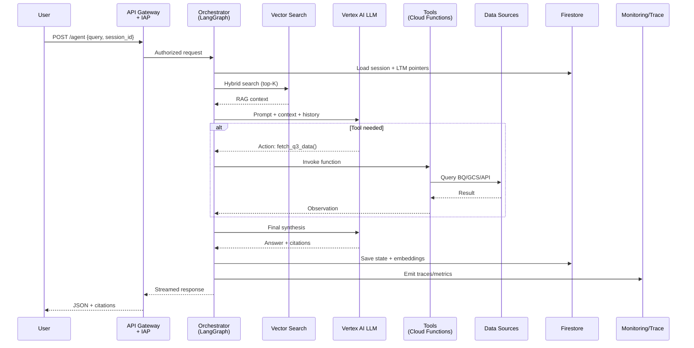

# **Agentic RAG + Tool-Use Framework on GCP**  
*Secure • Observable • Scalable • Production-Ready*

---

## **1. Overview**
A serverless, governed agentic AI platform on Google Cloud combining:
- **RAG** via Vertex AI Vector Search  
- **Tool-use** via LangGraph orchestration  
- **Memory** (session + long-term)  
- **Enterprise controls** (auth, safety, audit)

Built for production workloads with zero-ops scaling.

## **2. Core Components**

| Component | Service | Purpose |
|--------|--------|--------|
| **LLM** | Vertex AI (Gemini / Custom) | Reasoning, planning, response generation |
| **Embeddings & RAG** | Vertex AI + Vector Search | Semantic retrieval, long-term memory |
| **Data Layer** | BigQuery, Cloud Storage, APIs | Live + historical context |
| **Orchestration** | Cloud Workflows + Cloud Functions | LangGraph agent loop (ReAct) |
| **Session State** | Firestore | Cross-turn memory & citations |
| **API & Auth** | Cloud Endpoints + IAP/IAM | Secure entrypoint |
| **Safety** | Vertex AI Content Filters | PII, toxicity, policy enforcement |
| **Observability** | Cloud Monitoring, Trace, Vertex Metrics | Latency, traces, model health |

## **3. Request Flow (Simplified)**

**Textual Flow Summary:**

1. **User** → `POST /agent` with `query` + `session_id`  
2. **API Gateway + IAP** → Authenticate (OAuth/IAM)  
3. **Orchestrator (LangGraph)** → Load session from **Firestore**  
4. **Vector Search** → Hybrid retrieval (top-K docs)  
5. **Vertex AI LLM** → ReAct loop:  
   - Decide: retrieve more, call tool, or respond  
6. **If tool needed** → Invoke **Cloud Function** → Query **BigQuery/GCS/API**  
7. **LLM** → Final synthesis with tool results + context  
8. **Safety Filter** → Applied on *every* LLM call  
9. **Response** → Streamed with citations  
10. **State** → Persisted in Firestore + embeddings updated  
11. **Observability** → Traces & metrics emitted

## **4. Governance & Observability**

| Feature | Implementation |
|-------|----------------|
| **Authentication** | IAP + IAM (OAuth/API Key) |
| **Safety Filters** | Vertex AI (PII, toxicity, custom policy) on *every* LLM call |
| **Audit Logs** | Structured logs in Cloud Logging (request ID, user, prompt, response) |
| **Tracing** | Cloud Trace: full call graph (API → LLM → Tools) |
| **Metrics** | Vertex AI + Cloud Monitoring: latency, token usage, error rates |
| **Human Review** | Optional escalation via Cloud Tasks → Slack/Email |

## **5. Scalability & Performance**

| Layer | Scaling Model | Guardrails |
|------|---------------|----------|
| **API Gateway** | 10K+ RPS | Rate limiting, WAF |
| **Functions** | Auto-scale to zero | Concurrency limits, timeouts |
| **Vector Search** | Serverless | Index sharding, caching |
| **BigQuery** | On-demand | Query optimization, materialized views |
| **Firestore** | Auto-sharding | Read/write quotas |

> **Cost Model**: Pay-per-use. No idle capacity.

## **6. Deployment & Extensibility**

- **Infrastructure as Code**: Terraform or Deployment Manager  
- **Add new tools**: Deploy Cloud Function → register in LangGraph action group  
- **No core changes** required  
- **CI/CD**: Cloud Build + GitOps

## **Key Benefits**

| For **Users** | For **Teams** |
|---------------|---------------|
| Stateful, accurate responses | Full audit & governance |
| Real-time + historical data | Zero-ops serverless |
| Citations & transparency | Extensible tool library |
| Secure by default | Observable end-to-end |