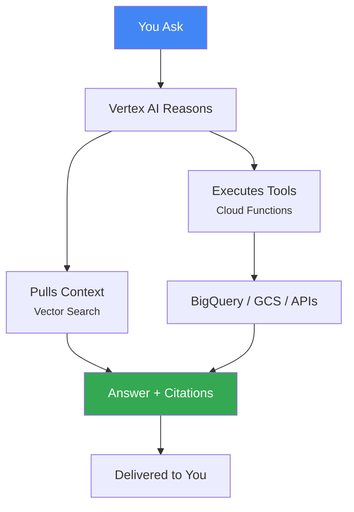

# **Agentic AI on GCP: The Enterprise Decision Engine**

## **Instant Insight, Guaranteed.**

Our Agentic AI solution transforms decision-making by securely fusing live data, historical context, and business logic into a single answer engine.

**Scenario:** "Summarize Q3 sales and recommend next steps." → **Result:** \<2 seconds to grounded, actionable output.

## **7 Reasons This Solution Outperforms Traditional AI**

This is a pre-built, production-ready framework designed for the enterprise.

| CORE CAPABILITY | BENEFIT & IMPACT |
| :---- | :---- |
| **100% Grounded Answers** | **Zero Hallucinations.** RAG \+ Vector Search ensures verifiable, cited answers. |
| **Live Data Fusion** | **Real-Time Insight.** Seamlessly fuse BigQuery live data with historical documents. |
| **Effortless Continuity** | **Stateful Conversations.** Firestore maintains multi-turn context across all user channels. |
| **Governance by Design** | **Audit-Ready Governance.** Vertex AI Safety Filters block PII and policy risks automatically. |
| **End-to-End Visibility** | **Full Observability.** Cloud Trace lights up every agent decision for transparent control. |
| **Infinite Scale, Zero Ops** | **Serverless Scale.** 10K+ RPS, auto-scale to zero, and pay-per-token cost efficiency. |
| **Fastest Time-to-Value** | **Rapid Deployment.** Go from vision to production in weeks using GCP-native frameworks. |

## **High-Level Architecture**

